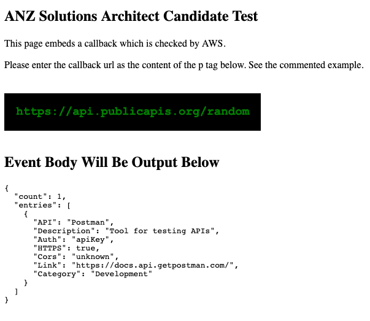

# AWS Fundamentals: Assignment 1

## Overview

This test requires you to configure a very simple web app.

The web app consists of two components:

  - A static webpage, integrated with React.js
  - A callback function, which returns some simple data.

You need to upload the static webpage somewhere web accessible. There's a clearly marked value in the source of the webpage that needs to be changed to the endpoint of the callback. Once this is done, your static page will call the callback, and you'll see the output.

## Downloading the assets

You can download the assets you'll need from here: <http://a.co/28wsX8D>

## Deliverables

Once you have configured everything, please send the **URL of your hosted webpage** to <aws-apac-sa-candidate@amazon.com>.

## Detail

The files you'll need to upload to make the static site work are:

  - `index.html`
  - `event_caller.js`

The code you'll need to host somewhere so that it can execute is:

  - `callbackcode.py`

It's up to you to figure where to run that code and how to expose it over the web.

The callback function is some Python code. It can't be executed in the browser, so need to be hosted somewhere that it can execute in response to a web request.

Everything should be uploaded to the Sydney AWS region if possible.

You should follow best practices for secure and performant web pages: use of HTTPS, a CDN, and so on.

## Screenshot of webpage with embedded callback

